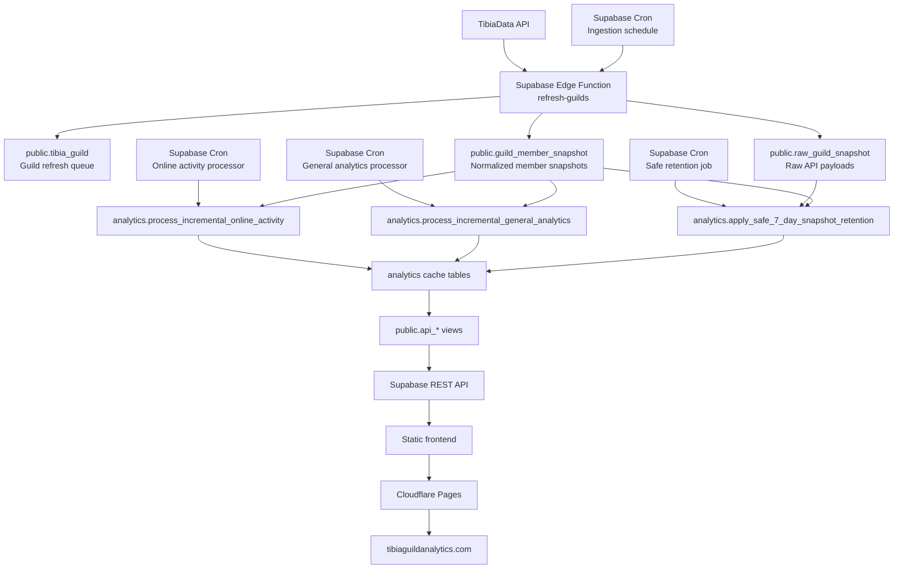

# Architecture Diagram

```mermaid
flowchart TD
    A[TibiaData API] --> B[Supabase Edge Function<br/>refresh-guilds]

    B --> C[public.tibia_guild<br/>Guild refresh queue]
    B --> D[public.raw_guild_snapshot<br/>Raw API payloads]
    B --> E[public.guild_member_snapshot<br/>Normalized member snapshots]

    F[Supabase Cron<br/>Ingestion schedule] --> B

    G[Supabase Cron<br/>Online activity processor] --> H[analytics.process_incremental_online_activity]
    I[Supabase Cron<br/>General analytics processor] --> J[analytics.process_incremental_general_analytics]
    K[Supabase Cron<br/>Safe retention job] --> L[analytics.apply_safe_7_day_snapshot_retention]

    E --> H
    E --> J
    D --> L
    E --> L

    H --> M[analytics cache tables]
    J --> M
    L --> M

    M --> N[public.api_* views]
    N --> O[Supabase REST API]
    O --> P[Static frontend]
    P --> Q[Cloudflare Pages]
    Q --> R[tibiaguildanalytics.com]
```
